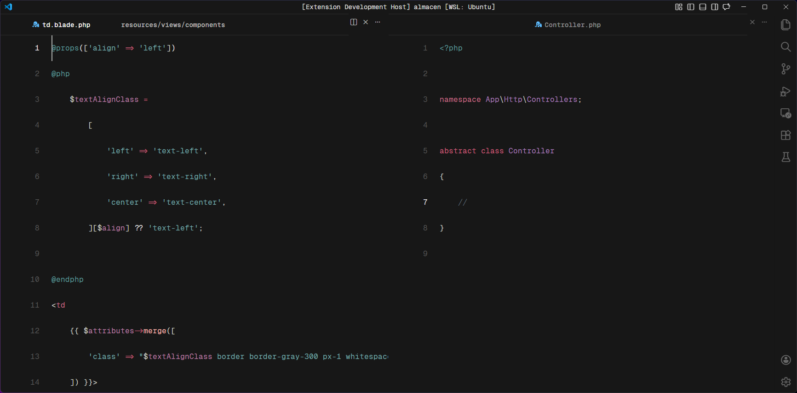
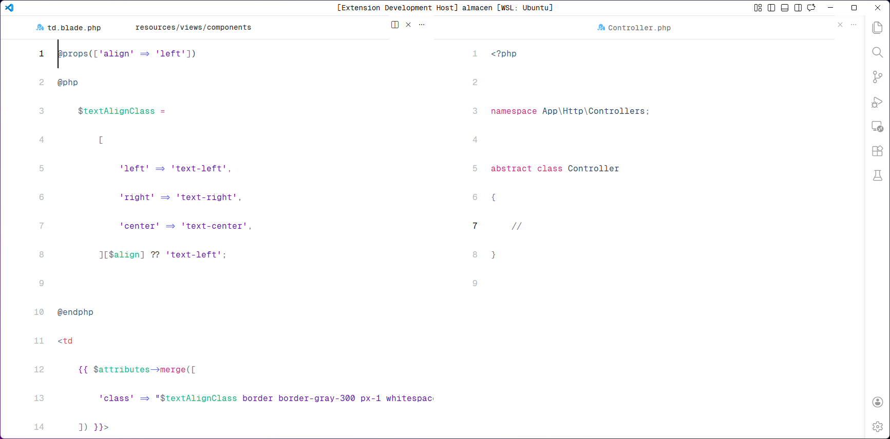

# Carbon Theme

A faithful port of [michaeldyrynda/carbon.vim](https://github.com/michaeldyrynda/carbon.vim) to Visual Studio Code.


## Screenshots

### Carbon Dark



### Carbon Light



## Color Palette

### Carbon Dark

| Element | Color |
|---------|-------|
| Background | `#171717` |
| Editor Background | `#171717` |
| Foreground | `#e0e0e0` |
| Accent | `#e74c3c` |
| Selection | `#3d5a80` |
| Line Highlight | `#2a2a2a` |
| Comment | `#555555` |

### Carbon Light

| Element | Color |
|---------|-------|
| Background | `#f4f4f4` |
| Editor Background | `#f4f4f4` |
| Foreground | `#161616` |
| Accent | `#e74c3c` |
| Selection | `#3d5a80` |
| Line Highlight | `#e8e8e8` |
| Comment | `#8b8b8b` |

## Installation

### From VS Code Marketplace

1. Open VS Code
2. Go to Extensions (Ctrl+Shift+X)
3. Search for "Carbon Theme"
4. Click Install

### From VSIX File

1. Download the `.vsix` file from [Releases](https://github.com/LC-jhony/carbon-theme/releases)
2. Open VS Code
3. Go to Extensions (Ctrl+Shift+X)
4. Click on "Install from VSIX..."
5. Select the downloaded file

## Activation

1. Open Command Palette (Ctrl+Shift+P)
2. Type "Preferences: Color Theme"
3. Select "Carbon Dark" or "Carbon Light"

## Features

- **Dark & Light themes** - Both variants included
- **Faithful Vim port** - Based on carbon.vim by Michael Dyrnda
- **Clean syntax highlighting** - Optimized for readability
- **Consistent UI colors** - All VS Code UI elements themed

## Recommended Settings

Copy and paste this configuration into your `settings.json` file to achieve the full Carbon Theme experience:

```json
{
    "window.zoomLevel": 1,
    "editor.fontFamily": "Fira Code",
    "editor.fontSize": 16,
    "editor.lineHeight": 45,
    "editor.fontLigatures": true,
    "editor.stickyScroll.enabled": false,
    "editor.renderWhitespace": "none",
    "editor.minimap.enabled": false,
    "editor.colorDecorators": false,
    "editor.guides.indentation": false,
    "editor.renderLineHighlight": "none",
    "editor.bracketPairColorization.enabled": false,
    "editor.scrollbar.horizontal": "hidden",
    "editor.scrollbar.vertical": "hidden",
    "editor.scrollbar.verticalScrollbarSize": 0,
    "editor.scrollbar.horizontalScrollbarSize": 0,
    "editor.gotoLocation.multipleDeclarations": "goto",
    "editor.gotoLocation.multipleDefinitions": "goto",
    "editor.gotoLocation.multipleImplementations": "goto",
    "editor.gotoLocation.multipleReferences": "goto",
    "editor.gotoLocation.multipleTypeDefinitions": "goto",
    "charmed-icons.hidesExplorerArrows": true,
    "workbench.colorTheme": "Carbon Dark",
    "workbench.statusBar.visible": false,
    "window.title": "${rootName}",
    "breadcrumbs.enabled": false,
    "editor.renderControlCharacters": false,
    "workbench.editor.showTabs": "none",
    "workbench.iconTheme": "charmed-light",
    "workbench.sideBar.location": "right",
    "window.menuBarVisibility": "toggle",
    "window.commandCenter": false,
    "workbench.editor.editorActionsLocation": "hidden",
    "workbench.layoutControl.enabled": false,
    "workbench.browser.showInTitleBar": false,
    "flow-icons.hidesExplorerFolders": true,
    "flow-icons.hidesExplorerArrows": true
}
```

### Recommended Icon Packs

Enhance your coding experience with these carefully selected icon extensions:

- [Charmed Icons](https://marketplace.visualstudio.com/items?itemName=MRk1dev.charmed-icons) - Elegant icon set for file explorers
- [Flow Icons](https://marketplace.visualstudio.com/items?itemName=mohdmaazkhann.flow-icons) - Modern icons with smooth animations

## Repository

[GitHub Repository](https://github.com/LC-jhony/carbon-theme)

## License

MIT License - See [LICENSE.txt](LICENSE.txt)

## Author

**LC-jhony**
- Email: jhonyapm94@gmail.com
- GitHub: [@LC-jhony](https://github.com/LC-jhony)

---

Enjoy coding with Carbon!
