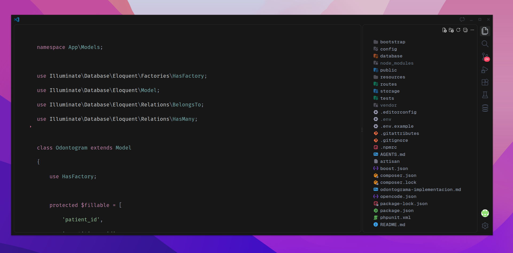
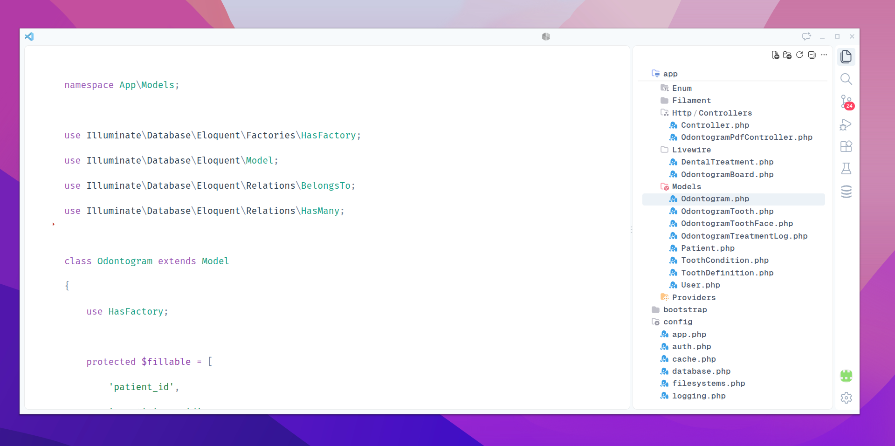

<p align="center">
  
</p>

<h1 align="center">Carbon Theme</h1>

<p align="center">
  A faithful port of <a href="https://github.com/michaeldyrynda/carbon.vim">michaeldyrynda/carbon.vim</a> to Visual Studio Code.
</p>

<p align="center">
  
  
  
  
</p>

---

## Screenshots

### Carbon Dark



### Carbon Light



## Color Palette

<details>
<summary><strong>Carbon Dark</strong></summary>

| Element | Color | Preview |
|---------|-------|---------|
| Background | `#171717` |  |
| Editor Background | `#171717` |  |
| Foreground | `#C9CCCD` |  |
| Accent | `#FF4262` |  |
| Selection | `#2C3F58` |  |
| Line Highlight | `#FF42620D` |  |
| Comment | `#5D6976` |  |

</details>

<details>
<summary><strong>Carbon Light</strong></summary>

| Element | Color | Preview |
|---------|-------|---------|
| Background | `#FFFFFF` |  |
| Editor Background | `#FFFFFF` |  |
| Foreground | `#2C3E50` |  |
| Accent | `#FF4262` |  |
| Selection | `#3498DB` |  |
| Line Highlight | `#FF426208` |  |
| Comment | `#718096` |  |

</details>

## Installation

### From VS Code Marketplace

1. Open **VS Code**
2. Go to **Extensions** (`Ctrl+Shift+X`)
3. Search for **"Carbon Theme"**
4. Click **Install**

### From VSIX File

1. Download the `.vsix` file from [Releases](https://github.com/LC-jhony/carbon-theme/releases)
2. Open **VS Code**
3. Go to **Extensions** (`Ctrl+Shift+X`)
4. Click on **"Install from VSIX..."**
5. Select the downloaded file

## Activation

1. Open **Command Palette** (`Ctrl+Shift+P`)
2. Type **"Preferences: Color Theme"**
3. Select **"Carbon Dark"** or **"Carbon Light"**

## Features

- **Dark & Light themes** — Both variants included
- **Faithful Vim port** — Based on carbon.vim by Michael Dyrnda
- **Clean syntax highlighting** — Optimized for readability
- **Consistent UI colors** — All VS Code UI elements themed
- **Minimalist design** — Clean interface with no visual clutter

## Recommended Settings

Copy and paste this configuration into your `settings.json` file to achieve the full Carbon Theme experience:

```json
{
    "window.zoomLevel": 1,
    "editor.fontFamily": "Fira Code",
    "editor.fontSize": 16,
    "editor.lineHeight": 45,
    "editor.fontLigatures": true,
    "editor.stickyScroll.enabled": false,
    "editor.renderWhitespace": "none",
    "editor.minimap.enabled": false,
    "editor.colorDecorators": false,
    "editor.guides.indentation": false,
    "editor.renderLineHighlight": "none",
    "editor.bracketPairColorization.enabled": false,
    "editor.scrollbar.horizontal": "hidden",
    "editor.scrollbar.vertical": "hidden",
    "editor.scrollbar.verticalScrollbarSize": 0,
    "editor.scrollbar.horizontalScrollbarSize": 0,
    "editor.gotoLocation.multipleDeclarations": "goto",
    "editor.gotoLocation.multipleDefinitions": "goto",
    "editor.gotoLocation.multipleImplementations": "goto",
    "editor.gotoLocation.multipleReferences": "goto",
    "editor.gotoLocation.multipleTypeDefinitions": "goto",
    "editor.lineNumbers": "off",
    "git.decorations.enabled": false,
    "charmed-icons.hidesExplorerArrows": true,
    "workbench.statusBar.visible": false,
    "window.title": "${rootName}",
    "breadcrumbs.enabled": false,
    "editor.renderControlCharacters": false,
    "workbench.tree.indent": 16,
    "workbench.tree.renderIndentGuides": "none",
    "workbench.editor.showTabs": "none",
    "workbench.iconTheme": "charmed-light",
    "workbench.sideBar.location": "right",
    "window.menuBarVisibility": "toggle",
    "window.commandCenter": false,
    "workbench.editor.editorActionsLocation": "hidden",
    "workbench.layoutControl.enabled": false,
    "workbench.browser.showInTitleBar": false,
    "flow-icons.hidesExplorerFolders": true,
    "flow-icons.hidesExplorerArrows": true,
    "workbench.secondarySideBar.defaultVisibility": "visible",
    "git.enableSmartCommit": true,
    "explorer.confirmDragAndDrop": false
}
```

### Recommended Icon Packs

Enhance your coding experience with these carefully selected icon extensions:

| Extension | Description |
|-----------|-------------|
| [Charmed Icons](https://marketplace.visualstudio.com/items?itemName=littensy.charmed-icons) | Elegant icon set for file explorers |
| [Flow Icons](https://flow-icons.pages.dev/) | Modern icons with smooth animations |

---

## Author

**LC-jhony**
- GitHub: [@LC-jhony](https://github.com/LC-jhony)
- Email: jhonyapm94@gmail.com

## License

This project is licensed under the [MIT License](LICENSE.txt).

---

<p align="center">
  Enjoy coding with <strong>Carbon</strong>!
</p>
